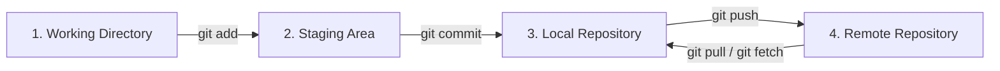

# Conceptos utilizados en git 

### Working directory - (Directorio de trabajo) ** FALTA EXPLICACION FACILL

**Estado:** Todavía Git no ha guardado esos cambios. ()

(img)

Es la carpeta real de tu proyecto donde editas los archivos.

- Creas archivos

- Modificas código

- Eliminas archivos

### Staging Area - (Área de preparación)

**Estado:** Es una zona intermedia donde preparas los cambios antes de guardarlos en el historal

```bash
archivo modificado - > git add archivo - > Staging Area
```

### Repository - (Repositorio)

Es el proyecto completo gestionado por Git, donde se guardan:

- historial de cambios

- commits

- ramas

- configuraciones

**Puede ser**

- Local (en tu computador)

- Remoto (en plataformas como GitHub o GitLab)

## Diagrama de flujo 


- upstream

## Conceptos tecnicos

| Objeto | Descripción            |
| ------ | ---------------------- |
| blob   | contenido de archivo   |
| tree   | estructura de carpetas |
| commit | snapshot del proyecto  |
| tag    | etiqueta de versión    |
