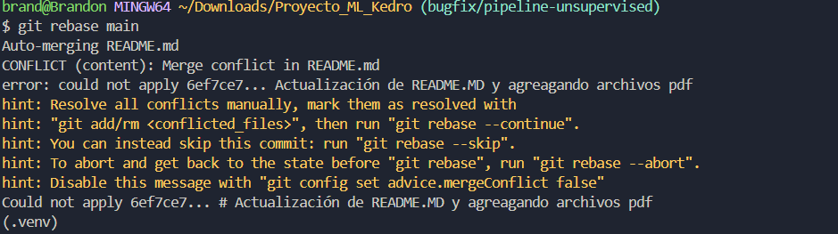
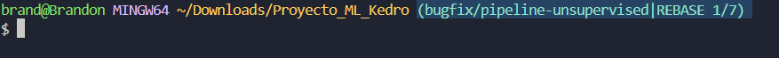
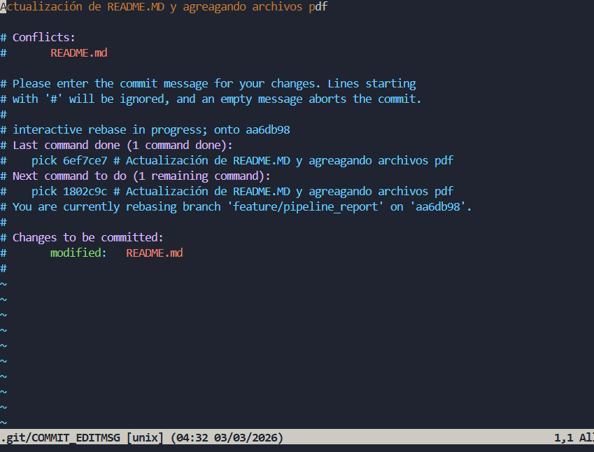

# Guía Práctica de Git - `merge`, `rebase` y resolución de conflictos

## Escenario

Cuando GitHub dice:

`This branch is 13 commits ahead of and 2 commits behind main`

Significa:

- **13 commits ahead** - (Cambios hacia adelante)
  
  Tu rama tiene **13 commits que `main` todavía no tiene**.

- **2 commits behind** - (Cambios hacia atras o atrasado)
  
  La rama `main` tiene **2 commits nuevos que tu rama aún no tiene**.

En otras palabras:

Tu rama avanzó por su cuenta, pero **`main` también siguió avanzando**.

| Mensaje GitHub | Significado                  |
| -------------- | ---------------------------- |
| ahead of main  | tu rama tiene commits nuevos |
| behind main    | te faltan commits de main (Actualiza tu rama creada)   |
| ahead + behind | las historias divergieron    |


Pero, **¿Por qué se mantendria una rama desactualizada?** Aqui una lista de como evitarlo: 

## Cosas a tener en cuenta para evitar que una rama quede desactualizada

- Revisar si main tiene nuevos commits
Antes de seguir trabajando, verificar si la rama principal recibió cambios.

- Actualizar el repositorio remoto frecuentemente
Ejecutar git fetch o git pull para traer los cambios recientes del repositorio remoto.

- Sincronizar tu rama con main regularmente
Integrar los cambios de main usando merge o rebase mientras desarrollas.

- Evitar trabajar demasiado tiempo sin actualizar
Si acumulas muchos commits sin sincronizar con main, aumentan los conflictos.

- Estar atento a merges de otras ramas
Otros desarrolladores pueden integrar nuevas funcionalidades a main.

- Recordar que Git no sincroniza automáticamente
Siempre debes ejecutar comandos como fetch, pull, merge o rebase para mantener tu rama actualizada.

## Ejemplo de ramas

### Rama 1 `main`

- Rama main o rama principal que contiene todos los cambios y cambios de ramas fusionadas

- **Commit totales:** 103 


### Rama 2: `bugfix/unsupervised-pipeline`

- rama que contiene cambios que no se han fusionado con la rama `main`

- **Commit totales:** 113 (Si tiene **muchos** cambios faltantes puede ser un problema) no es problema en x circunstancias.


---

## Visualmente

```
main
A---B---C---D

tu-rama
A---B---C---D---E---F---G
```

Luego alguien agrega commits en `main`:

```
main
A---B---C---D---H---I

tu-rama
A---B---C---D---E---F---G
```

Por eso GitHub indica:

```
ahead 3
behind 2
```

Tu rama tiene commits propios **pero está atrasada respecto a `main`.**

---

# 2. Formas de solucionarlo

Hay **dos estrategias principales**:

- `merge`
- `rebase`

---

# 3. Diferencia entre `merge` y `rebase`

## Opción 1 — `merge`

Trae los cambios de `main` **creando un commit de unión**.

```
git checkout bugfix/pipeline-unsupervised
git merge main
```

Resultado:

```
main
A---B---C---D---H---I

tu-rama
A---B---C---D---E---F---G---M
```

`M` = commit de merge

### Ventajas

- No reescribe historia
- Es seguro para trabajo en equipo

### Desventajas

- Historial más desordenado

---

## Opción 2 — `rebase`

Reaplica tus commits **encima del `main` actualizado**.

```
git checkout bugfix/pipeline-unsupervised
git rebase main
```

Resultado:

```
main
A---B---C---D---H---I

tu-rama
A---B---C---D---H---I---E'---F'---G'
```

Los commits se **recrean**, por eso cambian su hash.

### Ventajas

- Historial lineal
- Más limpio para proyectos grandes

### Desventajas

- Puede generar conflictos
- Reescribe historia

---

# 4. Diferencia entre `fetch` y `pull`

Muchos desarrolladores profesionales prefieren **usar primero `fetch`**.

## `git fetch`

```
git fetch origin
```

Descarga los cambios del remoto **pero NO los mezcla con tu rama**.

Solo actualiza referencias como:

```
origin/main
```

Es útil porque **te permite revisar antes de integrar cambios**.

---

## `git pull`

```
git pull
```

Internamente ejecuta:

```
git fetch
git merge
```

Es decir:

1. Descarga cambios
2. Los mezcla automáticamente

Por eso `pull` es **más rápido pero menos controlado**.

---

# 5. Flujo recomendado antes de hacer `rebase`

Actualizar primero `main`.

```
git checkout main
git fetch origin
git pull
```

Luego volver a tu rama:

```
git checkout bugfix/pipeline-unsupervised
```

---

# 6. Iniciar el `rebase`

```
git rebase main
```

Esto significa:

> “Reaplica mis commits encima del `main` actualizado.”

---

# 7. Git detecta conflictos

Git puede mostrar algo como:

```
CONFLICT (content): Merge conflict in README.md
error: could not apply 6ef7ce7
```

Esto significa que **dos commits modificaron la misma zona del archivo.**

---

# 8. Indicador del progreso del rebase

Git mostrará algo como:

```
REBASE 1/7
```

Esto significa:

- hay **7 commits que deben reaplicarse**
- estás resolviendo el **primero**

---

# 9. Ver archivos con conflicto

```
git status
```

Salida típica:

```
both modified: README.md
```

Esto indica que el archivo fue modificado en **ambas ramas**.

---

# 10. Resolver conflictos manualmente

Dentro del archivo aparecerá algo así:

```
<<<<<<< HEAD
contenido que viene desde main
=======
contenido de tu commit
>>>>>>> 6ef7ce7
```

Significado:

- `HEAD` → versión actual (`main`)
- `=======` → separador
- `>>>>>>` → tu commit

Debes:

1. decidir qué conservar
2. eliminar los marcadores

---

# 11. Ejemplo con notebooks (`execution_count`)

En archivos `.ipynb` puede aparecer algo como:

```
<<<<<<< HEAD
"execution_count": 2,
=======
"execution_count": 4,
>>>>>>> commit
```

Esto **NO es importante para el código**.

`execution_count` solo indica:

> cuántas veces se ejecutó la celda en Jupyter.

Puedes dejar cualquiera de los valores o reiniciarlo.

---

# 12. Marcar conflicto como resuelto

Una vez editado el archivo:

```
git add README.md
```

Esto le dice a Git:

> “El conflicto ya fue resuelto.”

---

# 13. Continuar el rebase

```
git rebase --continue
```

Git aplicará el siguiente commit.

El contador cambiará:

```
REBASE 2/7
REBASE 3/7
...
```

---

# 14. Editor de commit durante rebase

A veces Git abre el editor:

```
COMMIT_EDITMSG
```

Aquí puedes:

- editar el mensaje del commit
- o simplemente salir

En **Vim**:

```
ESC
:wq
ENTER
```

---

# 15. Si algo sale mal

Cancelar el rebase:

```
git rebase --abort
```

Esto devuelve el repositorio al estado anterior.

---

# 16. Cuando el rebase termina

Git mostrará:

```
Successfully rebased and updated refs/heads/bugfix/pipeline-unsupervised
```

Ahora tu rama tiene los commits **reconstruidos sobre `main`.**

---

# 17. Subir los cambios

Como el historial cambió, debes forzar el push:

```
git push --force-with-lease
```

`--force-with-lease` es más seguro que `--force`.

Protege contra sobrescribir trabajo de otros.

---

# 18. Resolver el Pull Request

Luego puedes:

1. ir a GitHub
2. abrir el **Pull Request**
3. hacer `Merge` hacia `main`

---

# 19. Imágenes del proceso

## Error de rebase



---

## Indicador REBASE 1/7



---

## Editor después de `rebase --continue`



---

# 20. Flujo completo recomendado

```
git checkout main
git fetch origin
git pull

git checkout bugfix/pipeline-unsupervised

git rebase main

# resolver conflictos
git add archivo
git rebase --continue

git push --force-with-lease
```

---

# Conclusión

`merge` y `rebase` resuelven el mismo problema:

> integrar cambios entre ramas.

Pero:

- `merge` → mantiene historia
- `rebase` → reescribe historia para que sea **lineal y limpia**
